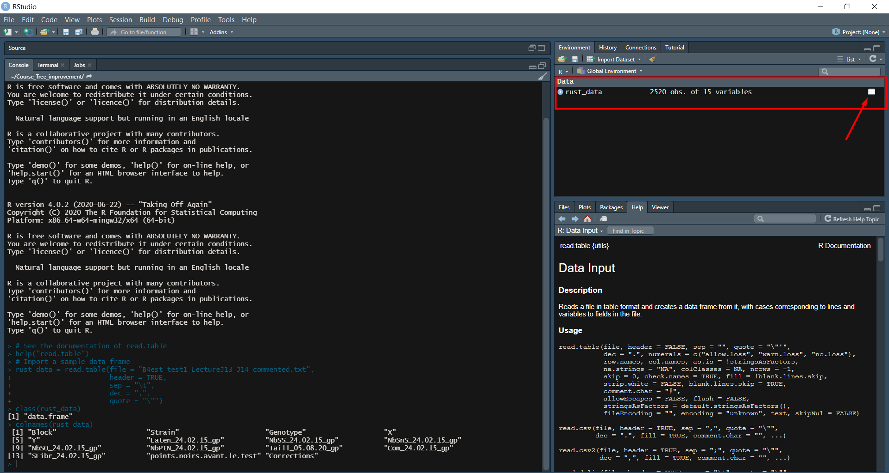

# About R

R is an object-oriented programming language. It is an integrated programming language where you can do data storage, data wrangling (modification), data analysis, statistical modeling, statistical tests, machine learning, and visualization.

You can even build a website, write a report or even a blog, and even build an app in R. Personally I enjoy doing everything in R. It was hard to start in the beginning because it was like learning a completely different language. But the basics were all I need to get started.

It is indeed impossible to master everything in R, but you can start off with the basics and keep learning with new methods and approaches while working with various data sets.

As R is also a multi-platform programming language, you can have access to many libraries that can help your analysis pipeline. The default library in R is **base package**, you don't need to download and install it before using it. Other libraries, **open-source packages**, are available for downloads. You have to download, install, and load them before using.

# Getting started

Download R and RStudio to your local computer.

So, R is essentially translating high-level language to machine codes. High-level language is a full sentence that you speak in everyday lives. In R, you have to simplify this language to pseudo-code (syntax, arguments) so R will understand. R then interprets the pseudo-code to machine code. Only then the machine can understand your request.

R is the console or the machine that interprets the pseudo-code you type to machine code. It then executes the pseudo-code.

RStudio is an Integrated Development Environment (IDE) or simply an interface to make coding easier. It can show you the objects you create in the Environment tab on the upper right panel. You can see the file directory you are on the Files tab in the bottom right panel. There are also sections for packages and help.

## Create a new script

In your RStudio, go to paperwhite button under File section on the task bar. Click it and click "R Script"


It will take you to a new work script. Here you can type codes. When you've finished and you want to save it, go to File --\> Save as...

I recommend you to save the file in all lower letters and without space. You can separate words using underscore sign ( \_ ).

## Change preferences/theme

If you want to change the preferences or the theme of your RStudio, you can go to Tools --\> Global Options --\> Appearance. You can play with the options there, then click Apply.

## Objects in R

You can create an object in R and assign a value in it. It is useful for analysis as you don't have to keep typing the same code over and over again. You can access the values stored in this object every time you're calling the object.

To run a code, press ctrl+enter

```{r objects}
# We want to do calculation
10+2

# This gives you the result. But if you want to access it again, you can't because you don't know how to call them

# This is where object is useful. You assign a name to the value and every time you want to access this value, you can just type the name

addition = 10 + 2

# Call the object
addition

# Integrating it with other calculation
substraction = addition - 5

substraction
```

## Data types in R

-   Integer: numbers such as 1, 2, 3, ... except decimals

```{r integer}
class(1) # class is a function to check the type of an object
```

-   Numeric: numbers including decimals

```{r numeric}
class(1.5)
```

-   Character: a type for words, letters, sentences. You should always put quotation marks in between a sentence, a word, or a letter to tell R that these are character data types. Otherwise, you will run to an error.

```{r strings}
class("hello, how are you?")
```

-   Data frame: a data table that contains observations in rows and variables in column. Example: data tables from Excel spreadsheet. I will explain about data frame in the next section.

-   Vector: an object that stores multiple values of the same data type. If you want to make a numeric vector, all the values inside it should be numeric. If you want to make a vector with another data type, you have to make sure that the values you input are of the same data type.

You can create a vector by manually entering the values. The values should be in the same data type. In this case, they values are in numeric data type.

```{r create vector 1}
create_vector = c(1, 2, 3, 4, 5)

create_vector

class(create_vector)
```

You can create a vector by passing a range of values.

```{r vector with range}
vector_2 = 1:10

vector_2
```

You can also ask R to generate random values to fill your vector. We will be using function sample() after the vector object we create.

-   sample(): the function to generate random numbers

-   argument 1:100 : the argument you give to R to say that you need random numbers within the range 1:100 . You can put any range in this argument

-   argument 15 (after the range): how many random numbers you need from the random number generator. In this case, I ask R to give me 15 random numbers within the range 1:100. You can put any number in this argument, it depends on your need.

-   Replace: TRUE, if you want the random numbers to come multiple times. FALSE, if you need the random numbers to come only once.

```{r random values}
vector_3 = sample(1:100, 15, replace = TRUE)

vector_3
```

However, if you use sample() and you run it a couple times, you will get different values for vector_3. This is not reproducible if you want to use vector_3 in your analysis. To solve this, we can call the function set.seed() before creating our vector with random numbers. You can try running these code multiple times and you will still get the same values.

```{r random seed}
set.seed(0)
vector_4 = sample(1:100, 20, replace = TRUE)

vector_4
```

## Accessing the values within vector

Vectors, lists, arrays, and data frames are indexed objects. This means that they store several values and assign to each of them a numerical index that indicates their position within the object. We can access the information stored in each of the positions by using object_name[position].

To access the second element (index = 2) in vector_4, we should code:

```{r index 2}
# See the inside of vector_4
vector_4

# Accessing the second element of vector_4
vector_4[2]
```

We can also access the elements in vector_4 by giving the range of indexes that we want to access. This is called **vector slicing**. For example, if we want to access the elements from range 2 to 5 in vector_4, we should code:

```{r vector slicing}
vector_4[c(2:5)]
```

We can also check the length of vector_4 using function length()

```{r length}
length(vector_4)
```

It basically shows you how many elements (or values) are stored in vector_4. Note that you can only access the elements within the length of vector_4. In other words, you can only access the elements from range 1 to 20. If you want to access an element in index 21 from vector_4, it is not possible because it is beyond the length of vector_4.

It applies to any vector you make with various length.

You can also add new values or elements to your vector. For example, if we want to add value 70 to index 21 in vector_4:

```{r add index21}
# Checking vector_4
vector_4

# Add a new value to vector_4 and store it to vector_5
vector_5 = vector_4 # copying everything in vector_4 to vector_5

# Check vector_5
vector_5

# Add a new value to vector_5
vector_5[21] = 70

vector_5

# How is it different from vector_4
vector_4
```

In this example I created a new vector (vector_5) by copying everything in vector_4. This is to keep the original elements in vector_4 so I can show you how vector addition looks like. I made the changes of vector_4 in vector_5.

I added a new value (70) to vector_5 and when I compared vector_5 and vector_4, there is now 70 in vector_5 that I can't find in vector_4.

## Mathematical operation in vector

You can do mathematical operation for the elements of a vector.

-   Multiplication

    Example: if we want to double every elements in vector_5

```{r double}
double_elm = vector_5*2

# Before multiplication
vector_5

# After multiplication
double_elm
```

-   Division

    Example: if we want to divide every elements in vector_5 by 5

```{r division}
division_5 = vector_5/5

# Before division
vector_5

# After division
division_5
```

-   Addition

    Example: if we want to add every elements in vector_5 with 4

```{r addition}
addition_4 = vector_5 + 4

# Before addition
vector_5

# After addition
addition_4
```

-   Subtraction

    Example: if you want to subtract every elements in vector_5 by 4

```{r subtraction}
subs_4 = vector_5 - 4

# Before subtraction
vector_5

# After subtraction
subs_4
```

Check this YouTube video for more arithmetic operations in vector:

[Create and Work with Vectors and Matrices in R \| R Tutorial 1.4 \| MarinStatslectures - YouTube](https://www.youtube.com/watch?v=2TcPAZOyV0U)

# Working with a data frame

## Setting your working directory

Important: before you do any analysis in R, you should set your working directory i.e. the folder where your data is saved. Not only that this is the folder where you save the data you need for analysis, but also this is the folder where your analysis results will be stored.

The path to the directory is specified in text format, so you type it **"in quotation marks"**.

The way to do it is:

```{r setwd}
setwd(dir = "C:/Users/firza/Documents/Course_Tree_improvement")
```

In dir =, you pass the folder where your file resides in your laptop.

## Checking the directory you are currently resided

Double check if you are in the right working directory. Just pass this function and R will return the location of the folder you are resided right now.

```{r getwd}
getwd()
```

## Importing a data frame

To import a data frame, you should use read.table() function in R. R support any kinds of data set, from flat files to raster files. This time you should be familiar on how to import a data frame from flat file formats, such as .csv or .txt. The read.table() function supports .csv and .txt files.

Arguments within the read.table function that you usually need to give to R:

-   It is advisable to save the data as an object.
-   file = the name of the file you want (it should reside in the folder that you set as your working directory). The file name is in text format, so you should type it in with quotation marks ( " " ).
-   header = TRUE if the first row of your data is the name of your variables
-   sep = separation between columns. If you're using .txt file like I do here, the separation between columns is made by a tab or "\\t". If you're using .csv file, the separation is made by a comma or " , ".
-   dec = the sign for decimal used in your file. Sometimes, different language uses different signs to make a decimal. In English keyboard, decimals are marked by a point or " . ", while in French keyboard, decimals are marked by a comma or " , " such as what we see in our data frame.

Fun YouTubers to follow if you want to learn R programming:

[Import Data, Copy Data from Excel to R CSV & TXT Files \| R Tutorial 1.5 \| MarinStatsLectures - YouTube](https://www.youtube.com/watch?v=qPk0YEKhqB8)

[R Programming for Beginners \| Complete Tutorial \| R & RStudio - YouTube](https://www.youtube.com/watch?v=BvKETZ6kr9Q)

```{r data frame}
# Import a sample data frame
rust_data = read.table(file = "B4est_test1_LectureJ13_J14_commented.txt",
                       header = TRUE,
                       sep = "\t",
                       dec = ",",
                       quote = "\"")

# See the documentation of read.table
help("read.table")

class(rust_data)
```

You can also use:

-   read.csv (for csv file with a header and decimal is marked with a point or " . ")

-   read.csv2 (for csv file with a header and decimal is marked with a comma or " , ")

-   read.delim (for txt file with a header and decimal is marked with a point or " . ")

-   read.delim2 (for txt file with a header and decimal is marked with a comma or " , ")

## Brief introduction to the data frame

Just a brief introduction to the data frame we use:

It is the data I used to observe resistance in black poplar. The data came from laboratory experiment. I had 154 individuals which were infected with 3 types of pathogen. I repeated the infection in 5 blocks. The resistance components I measured:

-   Latent period (named as Laten_24.02.15_gp in the data)

-   The numbers of spore (named as NbSS_24.02.15_gp, NbSnS_24.02.15_gp, and NbSO_24.02.15_gp)

-   Black points (named as NbPtN_24.02.15_gp)

-   The size of the spores (named as Taill_05.08.20_gp)

I'm giving you this information so that you understand what's inside the data frame. If you want to know the meaning of the variables and why I'm using them, you can contact me through email.

Data frame is essentially an array made of x rows and y columns. In a data frame, you will have observations in rows and variables in columns. You can access a certain column (i.e. variable) with the help of "\$" sign as given in the example below.

```{r dollar sign}
# accessing the genotype column
vector_genotype = rust_data$Genotype

class(vector_genotype)
```

When you check the class of vector_genotype, it returns 'character' because all the values are in character data type.

You can see the whole data by clicking the spreadsheet icon at the right side of your data frame object. You can find this in the "Environment" tab on the upper right panel.



## Head function

You can also check the first few rows of the data by using head() function. By default, it will show the first 6 rows of the data.

```{r head}
head(rust_data)
```

But, you can also specify how many rows you want R to return by passing the number in the n argument of the head() function

```{r n argument}
head(rust_data, n = 10)
```

## Tail function

You can also check the last few rows of your data using tail() function. You can specify the number of rows you want R to return in the n argument of the tail() function.

```{r tail n}
tail(rust_data, n = 10)
```

## To check the dimension of the data

You can check how many observations and variables are contained in the data frame using dim() function.

```{r dim}
dim(rust_data)
```

dim will return the number of rows (or observation) in the left side of the result and the number of variables (or columns) in the right side. The data frame we are using contains 2520 observations and 15 variables.

## To check the names of the variables

It is sometimes important to know the names of the variables. You can use the information to select, rename, or remove variables. To check the names of the variables, you can use colnames() function followed by the name of the data frame.

```{r colnames}
colnames(rust_data)
```

It returns a list of variable names. The list contains indexed names, meaning that each variable has its own position in the list. This indexes corresponds to the position of the variable in the data frame. For example, if you want to access variable "Laten_24.02.15_gp" by its index, you can do the following

```{r access vars}
vector_latent = rust_data[ , 6]

head(vector_latent)
```

Note that I leave a space in the beginning of the square brackets. This is because when you are accessing the index of an array (remember that a data frame is an array), you pass the index for the row in the left side of the bracket and the index of the column in the right side. So when you pass the following code, you are accessing the data in row 4 and in column 6.

```{r index array}
row_4_data = rust_data[4, 6]

row_4_data
```

Because you are accessing for the data in a specific position, you will get a single value. If you look back to the data frame, this value is essentially the latent period (Laten_24.02.15_gp) for genotype 6-A18 in block 1.

You can also access a certain row using the following code:

```{r access row}
row_4_vars = rust_data[4, ]

row_4_vars
```

The code returns all the information that entails the genotype 6-A18 in block 1. This is more intuitive than just getting the single value like before. If you only want to know the latent period for genotype 6-A18, you can do the following instead:

```{r only latent}
rust_data$Laten_24.02.15_gp[4]
```

How I did it is I first select the variable using the dollar sign "\$" and get only the row number 4

It is always best to access variables using their name with the help of the "\$" sign. Also, if you are accessing a big file, always keep them in an object to allow easy access.

```{r vars dollar}
vector_lat = rust_data$Laten_24.02.15_gp

head(vector_lat)
```

## Column slicing

Sometimes, it is also useful to use indexes to select columns or rows. For example, we can select the variables latent period (Laten_24.02.15_gp), spore number on the leaves (NbSS_24.02.15_gp), spore number under the water (NbSO_24.02.15_gp), black points (NbPtN_24.02.15_gp) and spore size (Taill_05.08.20_gp) in two ways:

-   Selecting based on the index. The indexes for the variables are from index 6 to 11. So we can do the following (it's called column slicing)

```{r col slicing}
col_slice_data = rust_data[, c(6:11)]

head(col_slice_data)
```

-   Selecting using column names using subset function. You can pass on the names of the columns into the argument select in the function.

```{r col subset}
col_subset_data = subset(rust_data, select = c("Laten_24.02.15_gp",
                                               "NbSS_24.02.15_gp",
                                               "NbSO_24.02.15_gp", 
                                               "NbPtN_24.02.15_gp"))

head(col_subset_data)
```

Maybe you want to know the names of the genotypes. You can add the genotype names into the subset function.

```{r with genot}
col_subset = subset(rust_data, select = c("Genotype",
                                          "Laten_24.02.15_gp",
                                          "NbSS_24.02.15_gp",
                                          "NbSO_24.02.15_gp",
                                          "NbPtN_24.02.15_gp"))

col_subset
```

## Returning the observation based on certain conditions

This part will be quite difficult to understand but important in data analysis life cycle. Sometimes you have to know how to select rows (or observations) based on certain conditions. Some words you can use to describe this process is: *subset a data set based on conditions*, *filtering*, *selection*.

You can use these words to Google the best practices.

In the data frame, I infected 154 genotypes with 3 types of pathogens. For example, I want to get the genotypes that were only infected by one pathogen named 09AX27.

```{r filter}
test1_09AX27 = rust_data[which(rust_data$Strain == "09AX27"), ]

head(test1_09AX27)

# There are only 840 observations in this subset
dim(test1_09AX27)

# While there are 2520 observations in the original data frame
dim(rust_data)
```

What I did there is from rust_data data frame, I pick the observations which the strain (i.e. pathogen types) is 09AX27. Because observations = rows, I am selecting rows. To select rows, you must keep this argument on the left side of the comma.

When you filter (or subset) a data frame, you are essentially reducing the observations based on the conditions you set to strict the filtering. That's why the rows being returned by the code above is reduced than the original number of rows.

## Checking data types

Remember that we're talking about data types such as string, numeric and integer in the above sections. We can check the data types of each variable from a data frame. It is important to check if the variables are in the correct types to avoid misleading analysis and errors.

For example, we do not want that a variable with numerical data type is being recorded as character type by R. When we do mathematical analysis with this variable, R will return an error because essentially you can't do mathematical analysis in character type.

One way to do it is by using class() function followed by the variable (remember to use the dollar sign to access a variable within a data frame) like I've showed you before.

```{r class}
class(rust_data$Genotype)

class(rust_data$Laten_24.02.15_gp)
```

Another way is by using str() function followed by the name of the data frame. This function will return the data types of all the variables contained in a data frame. Using this function, you can evaluate the data types of the variables at once. It saves you time as you don't have to check the variables one by one.

```{r str fun}
str(rust_data)
```

The str() function tells you:

-   The dimension of the data frame (obs and variables at the first line) --\> same results as when you're using dim()

-   The names of the variables --\> same results as when you're using colnames()

-   The types of the variables --\> same results as when you're using class() to each variable one by one

-   The data of the first few lines of the data frame --\> same results as when you're using head()

So, using str(), you can check all the stuff we learned at once. It is more efficient than calling the function (i.e. dim, colnames, etc.) one by one.

## Changing column names (renaming column)

Sometimes we also need to change the column names. Reasons like: inconsistency or names are too long is one of many reasons that lead us changing the column names. The reason mainly depends on your needs. If the long names makes it difficult to write your code, you can change it. You can change the column names using the following code:

```{r change var name}
# Checking the current column names
names(rust_data)

# If we want to change the names of Laten_24.02.15_gp
names(rust_data)[names(rust_data) == "Laten_24.02.15_gp"] = "Latent_period"

# Now you can see that the colname Laten_24.02.15_gp has been changed into latent_period
head(rust_data)
```

You can also change a group of columns at once

```{r group colname}
# Checking the current colnames
names(rust_data)

# Renaming the columns "NbSS_24.02.15_gp" until "Com_24.02.15_gp"
# First you make a list of the new names
# The order in the list should be the same as the order in names(rust_data)
new_names = c("Spore_number_1", "Spore_number_2", "Black_points",
              "Spore_size", "Comment")

# Selecting the columns you want to rename using their index
# Assigning the new_names list into that selection
names(rust_data)[7:12] = new_names

# Checking the data again. The colnames must've changed by now
head(rust_data)
```

What I'm doing here is I first checked the column names. Then I decided to change the names of the column NbSS_24.02.15_gp until Com_24.02.15_gp.

If you view the rust_data, you will see that there are other 3 columns in between NbSS and Com. I want to change their name too.

You can do repetitive task and change the column names one by one. But it's time consuming and not effective. Instead, you already know how many columns you want the names to be changed (i.e. 5 columns) and you know the orders.

You can make a list consisting of 5 new names for our 5 columns. The order of the new names should be the same as the order of our current column names. If we want to name from NbSS to Com, you should type the new names exactly in that order.

Next, I am telling R to select only column 7 to 12. If you view rust_data data frame, you can hover your mouse around the column you want. An information box will show and will tell you the order of your column (column no. X). For example, for NbSS the column number is 7 and Com is 12.

Then these column names are equal to the names that I just typed in the new_names object.

When you run this code, R will essentially assign the new names to the old ones. You can verify the change but calling the head function.

## Sorting data

You also need to know how to sort your data. For example, I want to sort the data based on the genotypes name.

```{r sort genot}
# Checking the column names
names(test1_09AX27)

# Sorting based on genotypes names
sort_genot = test1_09AX27[order(test1_09AX27$Genotype),]

# See the difference
# Before sorting
head(test1_09AX27)

# After sorting
head(sort_genot)
```

Next, I also want to know the biggest latent period from the subset data test1_09AX27 (i.e. genotypes infected by pathogen 09AX27).

```{r sort LP}
# Sorting based on latent period
sort_latent = test1_09AX27[order(-test1_09AX27$Laten_24.02.15_gp),]

# Check the results
head(sort_latent)
```

Note that to find the biggest latent period I put minus (-) in front of test1_09AX27\$Laten_24.02.15_gp. This is to tell the order function to sort in descending order (large to small). If you don't put the minus sign, the order function will just sort the column in ascending order (small to large).

# Descriptive statistics

We can also find the average, maximum and minimum number, median, mode and standard deviation for each column. Together, these measures are called descriptive statistics. How these are applicable in real-life situations is described in this video:

[Quantitative Research \| Descriptive Statistics - YouTube](https://www.youtube.com/watch?v=oKzMTWu1Oow)

-   Average

For example, I want to find the average of latent period in test1_09AX27 data frame. I only need to pass the following code:

```{r avg}
mean(test1_09AX27$Laten_24.02.15_gp)
```

-   Median

The median of latent period in test1_09AX27 data frame.

```{r median}
median(test1_09AX27$Laten_24.02.15_gp)
```

-   Standard deviation

```{r std}
sd(test1_09AX27$Laten_24.02.15_gp)
```

-   Max and min number

```{r max min}
max(test1_09AX27$Laten_24.02.15_gp)

min(test1_09AX27$Laten_24.02.15_gp)
```

However, if you want to know the statistics for all of the variables, doing this is not effective. There is a function that returns the statistics of all the variables at once. It's called summary()

```{r summary}
summary(test1_09AX27)
```

This function gives you the statistics for all the variables. It returns the data type, min, first quartile (Q1), median (Q2), mean, third quartile (Q3), max, and the total observations with NA (missing values). This is very handy to get and to remind you the characteristics of your data.

# Example of installing a package

R consists of a built-in package and participatory/custom packages.

The built-in package is called *base* package, it comes together with R installation. It does not need any configuration prior to utilization, such as installation or initial calling. The operations above are the good example of using R base package.

The participatory/custom packages are packages built and uploaded by experts/ communities/ developers/ analysts/ data scientists/ general public to serve certain purposes. These packages need initial configuration prior to utilization, such as installation and initial calling.

As an example of installing a package, I will use ggplot2 package. It's a popular visualization package beyond the R base visualization package. I personally more comfortable using ggplot2, but I won't make its tutorial here because the syntax is more complex than the base package.

## Installation

To install ggplot2 package, you can go to "Packages" tab in the bottom right panel. Then click "Install" and a pop-up box will show up.

In the pop-up box make sure that the section "install from" is set to "Repository (CRAN)", this is the central R library that hosts all the packages.

Then in the section "Packages", type the package you want to install (make sure that the spelling is exactly the same, even the capital and lower words, ggplot2 is not the same as Ggplot2). In this case, type "ggplot2". R will automatically show the option for it. Section "Install to library" gives you the location of the package in your computer once it's downloaded. Check the box "Install dependencies" then click install. Then wait for a moment while the download is running.

The progress will be shown in the console page in the bottom left panel. There will be red sign on the top of that panel that indicates R is running the download. When the red sign is gone and the message "the downloaded file is in ...." (or similar), it means that the download is finished.

When it's finished, you have to call the package before using it. It needs library() followed by the name of the package.

```{r call package}
library(ggplot2)
```

Then you're ready to use the package.

I would recommend you to be comfortable with the basic with R base package before trying other packages. Most of the time, base package is enough for your analysis and you need one to five additional packages for extensive analysis pipeline. More if you need other packages to optimize your analysis pipeline. I personally use 1 - 7 packages for the whole pipeline (preparation to modeling).

There are many packages you can learn but you don't need to learn them all. Usually a simple Google search, a help from fellow researchers/IT friends, or help from relevant research papers will guide you to a package that is suitable for your use.

# Visualization

Data visualization is an important part of data analysis or data science pipeline. It communicates the insights or the results from our data. It guides people to come up with a decision, i.e. to improve management, to increase performance, to add values to the products, etc. You can check the importance of data visualization here

[What is Data Visualization in 3 minutes ? - YouTube](https://www.youtube.com/watch?v=VyhLRJVoIrI)

In this section I will use another data frame called mtcars. The data is provided by ggplot2 package.

```{r load mpg}
cars_data = mtcars
```

The description of mtcars data is provided in the help page

```{r desc}
help(mtcars)
```

-   Scatter plots

To see relationship between two variables i.e. correlation, linear regression

Important arguments you have to give:

x = the variable to be plotted in the x-axis

y = the variable to be plotted in the y-axis (remember, to access the variable you should put the dollar sign in between the data frame and variable name)

main = the title of the plot, in character, should be put in between quotation marks

xlab and ylab = title for x-axis and y-axis, respectively

pch = the model of the point (to see the list of pch choices: [R plot pch symbols : The different point shapes available in R - Easy Guides - Wiki - STHDA](http://www.sthda.com/english/wiki/r-plot-pch-symbols-the-different-point-shapes-available-in-r))

```{r scatter}
plot(x = cars_data$wt, y= cars_data$mpg, 
     main = "Relationship between miles per gallon (mpg) and car weight (wt)",
     xlab = "Car Weight (1000 lbs)", ylab = "Miles per Gallon",
     pch = 19)
```

You can also differentiate the colors based on number of cylinders (cyl), for example.

```{r scatter col}
plot(x = cars_data$wt, y= cars_data$mpg, 
     main = "Relationship between miles per gallon (mpg) and car weight (wt)",
     xlab = "Car Weight (1000 lbs)", ylab = "Miles per Gallon",
     pch = 19,
     col = cars_data$cyl)
```

Advanced scatter plots: [Quick-R: Scatterplots (statmethods.net)](https://www.statmethods.net/graphs/scatterplot.html)

-   Barplot

Barplot is used to understand the frequency of a data. For example, we can check how many cars that have 3, 4, or 5 gears. The information is stored in gear variable (cars_data\$gear).

First, let's check the structure of each variable

```{r mtcars str}
str(cars_data)
```

Let's plot the distribution of cars_data\$gear

```{r gear dist}
plot(x = cars_data$gear)
```

From the graph , it can be seen that the distribution is kind of weird. But there is a pattern here, there are cars fall only in 3-gears category, others fall only in 4-gears or 5-gears category. It seems that the gears variable is categorical and is a group. This kind of data should be stored as "factor" data type.

If we go back to the result from str(), gear variable is in numeric type. This is not the right data type. We should convert it to factor.

```{r convert}
cars_data$gear = as.factor(cars_data$gear)

str(cars_data)

# Checking the total number of gear categories
levels(cars_data$gear)
```

There are three categories for gear variable: 3-gears, 4-gears, or 5-gears. Now we can plot how many cars belong to each gear categories. We can use plot() to automatically design a plot for us.

```{r gear freq}
plot(x = cars_data$gear,
     main = "Number of cars with 3, 4, or 5 gears",
     xlab = "Number of gears", ylab = "Number of cars")
```

The graph is called barplot. You can also plot a barplot using `barplot()` function.

For this purpose, we need to plot the frequency of the `mtcars$gear` rather than the whole column. We use the `table()` function for this purpose.

```{r barplot gear}
barplot(height = table(cars_data$gear),
        main = "Number of cars with 3, 4, or 5 gears",
        xlab = "Number of gears", ylab = "Number of cars")
```

More information: [Creating Bar Plots in R - JournalDev](https://www.journaldev.com/36249/bar-plots-in-r)

-   Histogram

Histogram is used to understand data distribution and data frequency. For example, we want to check the distribution of horsepower that the cars have. This information is stored in `cars_data$hp.`

```{r hist}
hist(x = cars_data$hp,
     main = "Numbers of cars with their respective horsepower",
     xlab = "Horsepower", ylab = "Frequency")
```

For more information on what charts to use:

[Which is the best chart: Selecting among 14 types of charts Part I - YouTube](https://www.youtube.com/watch?v=C07k0euBpr8)

# Final words

## Other options

R is great, but there are other options such as Python. R and Python are similar and they have the biggest community, open source database, and public packages/libraries. I recommend you to learn R or Python because:

-   You can always find free or cheap online courses dedicated to R or Python

-   Most data scientists are either using R or Python. Your teachers or colleagues or IT friends are most likely have experiences in R or Python. You can ask for a help from them whenever you encounter problems.

-   You can find the answers to almost all your confusion just by typing your problems in Google. There are big support communities that use R or Python.

## Personal thoughts

Personally, I would recommend you to learn R or Python. Integrate them in your analysis pipeline. Once you get a good grasp with the basics, learn new methods and challenge yourself to use the new methods in your next analysis. There are always spaces to improve and optimize your code.

I save a lot of time by mastering R. I initially used R only to analyze data. Then I explored other features, such as R markdown which allows me to code and write report at the same time. I could also automate some analysis, such as opening file and do a bit of cleaning (using loop and function). It saves a lot of my time. I can automatically cite paper and put them directly to my References section. R just made my life more efficient.

Another positive thing about learning R or Python is that you create more opportunities for yourself. There are many companies looking for Data Analysts or Data Scientists. The salary is quite higher than average, for example the median gross annual salary for a Junior Data Analyst is 50k Euros/year in Paris and Berlin. In the US, you can even get up to 70k Euros/year. The growth of the position is high, there is a rising demand in many industries (24% in the next few years). You can move forward to senior positions real fast, like 1 - 2 years and you will be in intermediate level, another 2 years to get to senior level.
